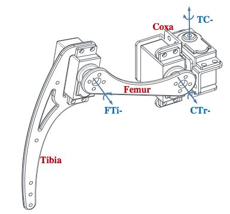
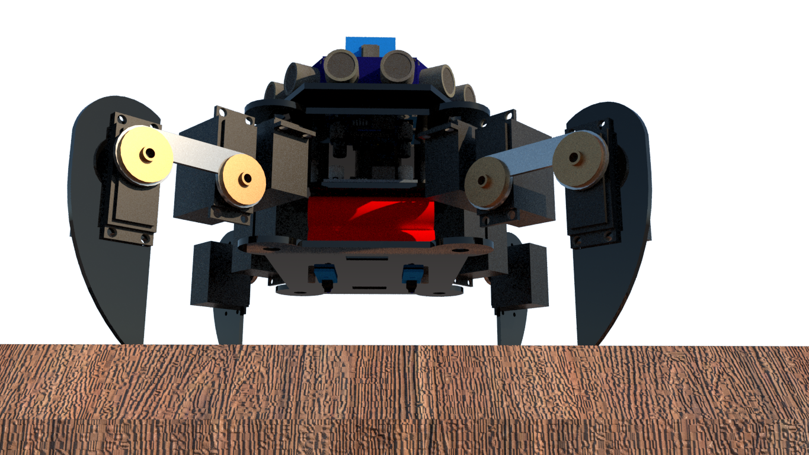
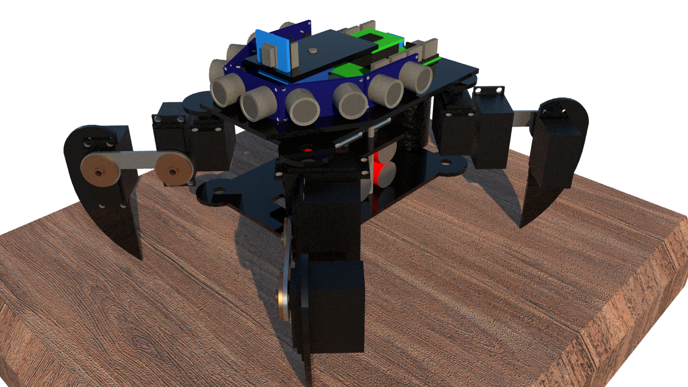
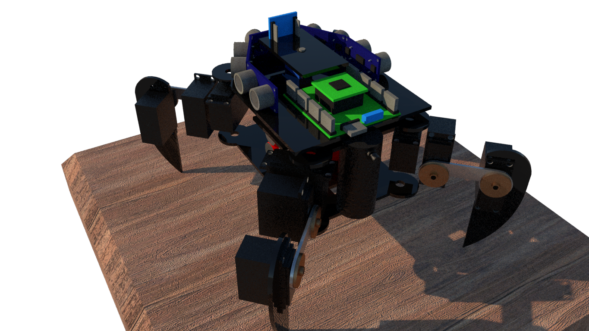
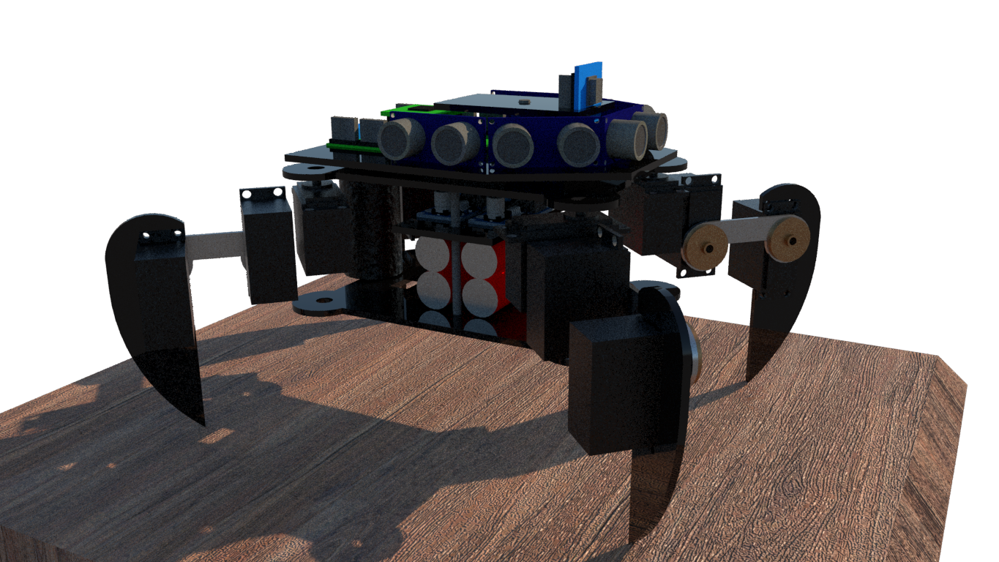
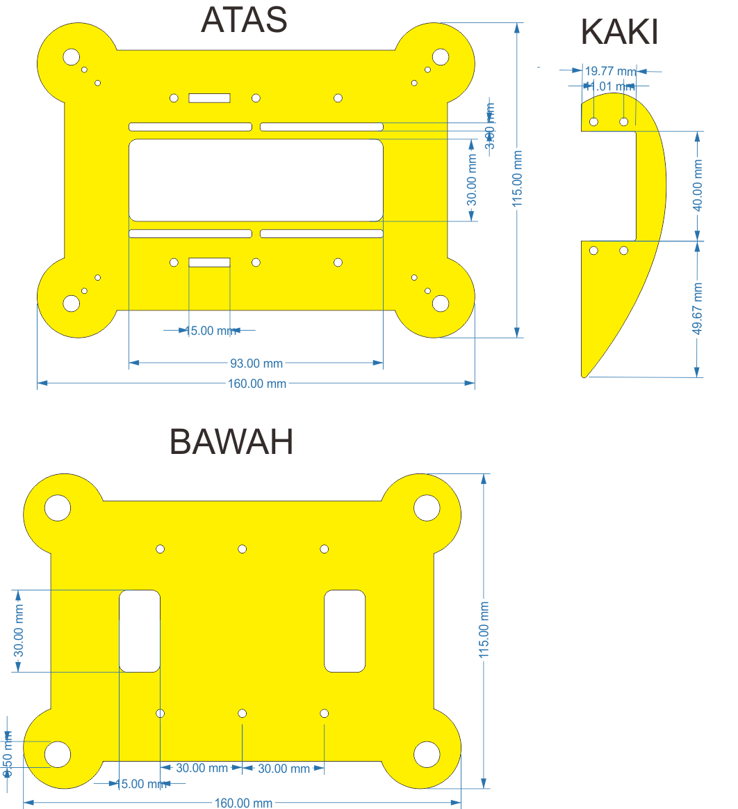

# Quadpod
Robot 🕷 berkaki 4 dengan konfigurasi 3 DOF (Degree Of Freedom) berbasis Arduino \

## Komponen yang digunakan
- Servo - Hitec HS-645MG (12x) [Dataseheet](https://www.robotshop.com/media/files/pdf/hs645mg.pdf)
- Kerangka Body - Akrilik 2mm
- Kontroller - Atmega 128 
- Power Regulator - Modul LM2596

## Konfigurasi

### Arduino - Atmega 128
Menggunakan Framework [MegaCore](https://github.com/MCUdude/MegaCore) untuk menjalankan program Arduino dalam Atmega 128

#### TLDR Cara Install Board MegaCore
- Copas ke **Additional Boards Manager URLs** di **Prefrence Menu** 
`https://mcudude.github.io/MegaCore/package_MCUdude_MegaCore_index.json`

- Install **MegaCore** dari **Board Manager**

Cara lengkap cek sumber [MegaCore How to Install](https://github.com/MCUdude/MegaCore#how-to-install)

#### Pinout Atmega128

## Desain Robot
### Render Desain 3D

### Desain Kerangka Akrilik

