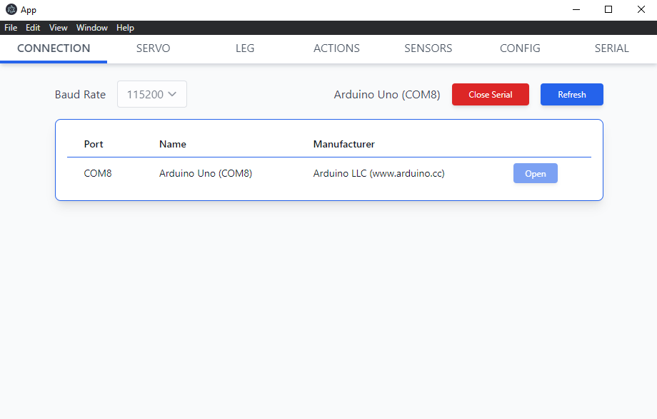
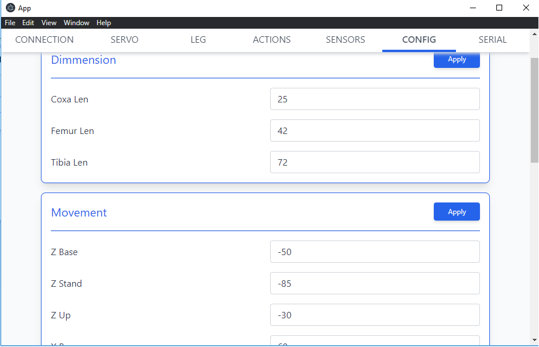
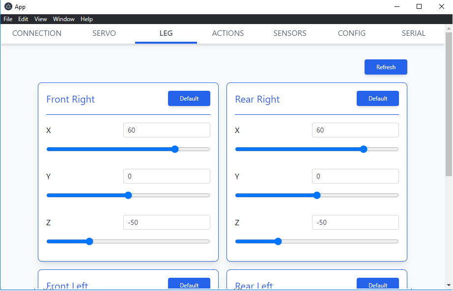
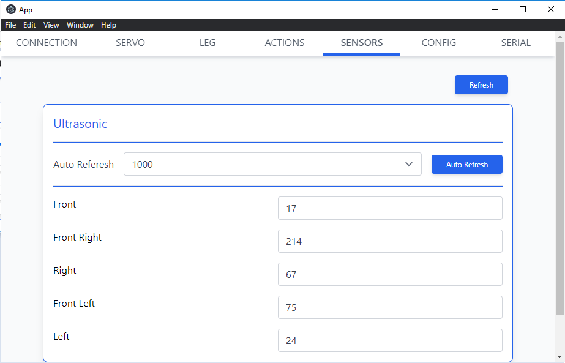
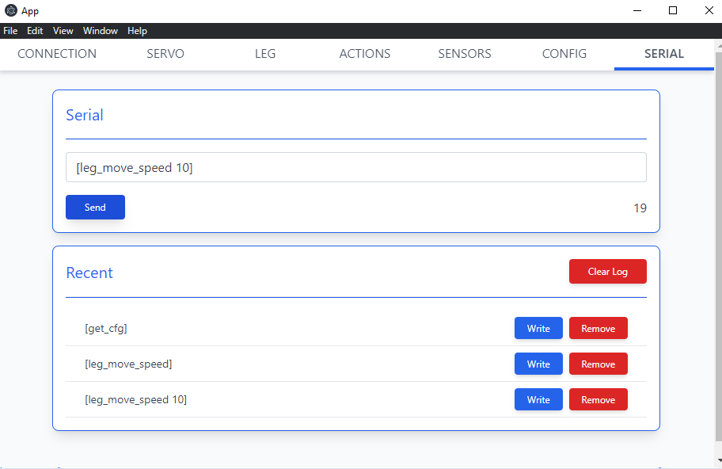

Aplikasi kontrol dan monitoring robot [Quadpod](https://github.com/nazililham11/Quadpod).
Basis repository [Electron SerialPort](https://github.com/serialport/electron-serialport)







## Framewrok / Library yang digunakan
- Electron js
- Vue js
- Tailwind css
- SerialPort

## Masalah yang ditemukan 🐛
- Terkadang daftar serial yang tersedia tidak muncul (Refresh / membuka ulang aplikasi bisa mengatasi masalah)
- Terkadang tidak dapat terkoneksi ke serial yang sebelumnya perna terkoneksi (Reconnect kebel bisa mengatasi masalah)
- Dan lain lain 🗿

## Cara Install 💾
```bash
# Clone this repository
git clone https://github.com/nazililham11/Quadpod.git
# Go into the repository
cd quadpod/app
# Install dependencies
npm install
# Run the app
npm start
```